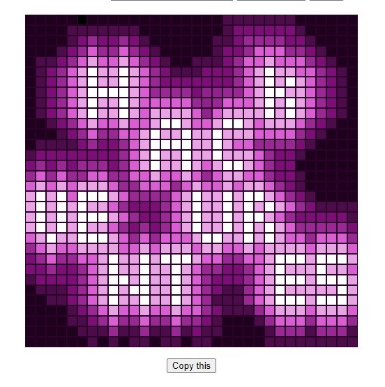

# Filter Designer

Filter Designer is a web application developed as a part of the HackVenture 1.0 challenge organized by UoK. It allows users to design filters by creating custom patterns using a grid of cells. This tool was developed by Team Epsilon.

## Deployed at:
```
https://hackventures-grid-collage.netlify.app/
```

## Example Usage


## Features

- **Grid Layout**: Users can specify the size of the grid, which determines the number of cells displayed in a single row.
- **Color Selection**: Users can select colors using a color picker tool.
- **Cell Coloring**: By clicking on individual cells, users can change their color to the selected one.
- **Design Creation**: Users can create intricate designs and patterns by coloring cells as per their requirements.
- **Output Generation**: Upon clicking the "Generate Output" button, the application displays a string representing the cell indices along with their corresponding colors in a JSON object format.

## Usage

1. Visit the [Filter Designer]([https://example.com](https://hackventures-grid-collage.netlify.app/) website.
2. Specify the size of the grid (number of cells per row).
3. Use the color picker tool to select a color.
4. Click on individual cells to change their color.
5. Design your filter by coloring cells accordingly.
6. Once satisfied, click the "Generate Output" button.
7. Copy the generated JSON object containing cell indices and colors for further use.
8. Who can apply your filters and create collages using [this notebook](https://github.com/Savith-02/jupyter-make-collage), created also as a part of the challange.

